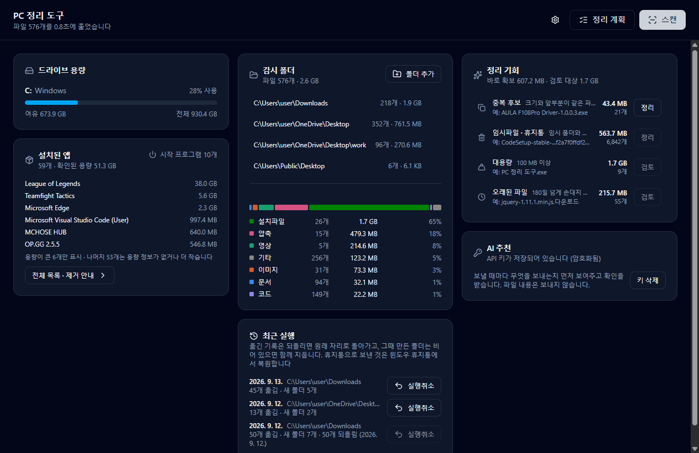

# PC 정리 도구

내 컴퓨터의 파일·폴더·설치된 앱 현황을 한 화면에서 보고, 정리할 거리를 찾아주는 Windows 데스크톱 앱.



## 지금 할 수 있는 것

**영구 삭제는 없다.** 보고, 계획을 세우고, AI에게 물어본 뒤, 사용자가 확인한 이동만 실행하고
되돌린다. 지우는 것은 중복 후보뿐이고, 그것도 윈도우 휴지통으로만 보낸다.

- **드라이브 용량** — 로컬 드라이브별 사용량과 여유 공간
- **감시 폴더** — 다운로드·바탕화면 등 등록한 폴더의 파일 수와 용량, 종류별 구성
- **정리 기회** — 중복 후보, 임시파일·휴지통, 대용량, 오래된 파일
- **설치된 앱** — 설치 프로그램 목록과 용량, 시작 프로그램 개수
- **정리 계획** — 감시 폴더 바로 아래의 파일·폴더를 **칸반 보드**로 보여준다. 폴더가 열, 항목이
  카드다. 확장자 규칙이 초안을 깔고, 카드를 다른 열로 끌거나(Ctrl+클릭으로 여러 장) ✕로 '그대로
  두기' 열에 보내고, 새 폴더 열을 만들고 이름을 고친다. 카드에 보일 정보(크기·수정일·종류·이유)는
  직접 고른다
- **AI 추천** — Anthropic API 키를 넣으면 파일 **이름·종류·크기·수정일만** 보내 "키보드 드라이버",
  "가게 홍보물"처럼 의미로 묶은 폴더를 제안받는다. 보내기 전에 무엇을 보내는지 먼저 보여주고
  확인을 받으며, 파일 내용·전체 경로·사용자 이름은 보내지 않는다. AI는 이동·분류만 제안하고
  삭제는 제안할 수 없다(응답 스키마에 그런 항목이 없다)
- **실행** — 판의 결정을 실제로 옮긴다. 누르기 전에 무엇이 어느 폴더로 가는지 한 번 더 보여주고,
  옮기기 전 점검에서 하나라도 걸리면(목적지에 같은 이름이 있음, 원본이 사라짐 등) **아무것도 옮기지
  않는다**. 이름을 바꾸지 않고, 덮어쓰지 않고, 다른 드라이브로 복사하지 않는다. 실행 기록이 남아
  **실행취소**로 원래 자리에 되돌릴 수 있다(대시보드 '최근 실행'에서 앱을 다시 켠 뒤에도). 되돌리면
  그때 만든 폴더도 비어 있으면 함께 치운다 — 무언가 들어 있으면 남긴다
- **중복 후보 정리** — 크기와 앞 4KB가 같은 파일 그룹에서 남길 하나를 고르면 나머지를 **윈도우
  휴지통**으로 보낸다. AI는 관여하지 않는 규칙 기능이다. 보내기 전에 그룹의 파일 전체를 다시 해시해
  하나라도 다르거나 사라졌으면 아무것도 보내지 않고, 드라이브의 휴지통 설정도 먼저 본다 — 휴지통
  최대 크기 이상인 파일이나 '휴지통을 쓰지 않음' 드라이브는 윈도우가 휴지통을 거치지 않고 영구
  삭제하므로 보내지 않는다. 되돌리기는 윈도우 휴지통에서 복원한다

영구 삭제 호출(`unlink`·`rm`·휴지통 비우기)은 코드 어디에도 없다. 되돌릴 수 없는 동작은 버그 하나가
곧바로 사용자 파일 손실이 되기 때문이다.

## 실행

```bash
npm install
npm run dev        # 개발 모드로 실행
npm run lint       # ESLint
npm test           # 테스트
npm run typecheck  # 타입 검사
npm run build      # 타입 검사 + 번들
npm run verify     # 위 네 가지를 한 번에 (커밋 전 검사와 같은 내용)
npm run package    # 설치 파일 생성 (release/)
```

Windows 전용이다. 드라이브 용량과 설치된 앱 목록을 Windows에 기본 탑재된 PowerShell로 조회한다.

AI 추천을 쓰려면 대시보드의 'AI 추천' 카드에 Anthropic API 키를 넣는다. 키는 Windows DPAPI로
암호화해 `%APPDATA%\pc-organizer\secrets.json`에 저장되고, 화면으로 다시 돌아오지 않는다.

## 검증 장치

이 프로젝트의 불변 조건은 문서로만 두지 않고 세 겹으로 강제한다.

**1. ESLint가 아키텍처를 막는다** (`eslint.config.mjs`)
renderer에서 `node:*`나 `electron`을 import 하면 에러다. `src/main/services/`가 `electron`을 끌어오면
에러다. main에서 `window`를 쓰면 에러다. 프로세스 경계와 테스트 가능성을 사람의 기억이 아니라
규칙으로 지킨다.

**2. 리뷰 스킬과 리뷰어 에이전트** (`.claude/skills/review/`, `.claude/agents/code-reviewer.md`)
클라우드 전용 파일을 읽지 않는지, 1단계에 쓰기 코드가 들어오지 않았는지, 겹치는 용량을 더하지
않았는지 등 린터가 잡을 수 없는 것을 확인하는 절차. Claude Code에서 code-reviewer 에이전트로 돌린다.

**3. 커밋 전 훅** (`.claude/hooks/pre-commit-verify.mjs`)
`git commit`이 실행되기 전에 린트 → 타입 검사 → 테스트 → 빌드를 돌리고, 하나라도 실패하면 커밋을
막는다. 약 5초. 깨진 상태의 커밋이 히스토리에 남으면 어느 지점이 정상이었는지 되짚기 어려워진다.
git 자체의 pre-commit 훅이 아니라 Claude Code의 PreToolUse 훅이라, 터미널에서 직접 치는 git에는
걸리지 않는다.

## 구조

```
src/
├─ shared/     main과 renderer가 함께 쓰는 타입·IPC 채널·API 계약
├─ main/       파일시스템과 레지스트리를 만지는 유일한 곳
│  ├─ ipc/     채널 등록 (로직 없음)
│  ├─ services/  스캐너, 분류, 집계, 중복 탐지, 설치 앱, 설정 저장
│  └─ lib/     PowerShell 호출, 해시
├─ preload/    contextBridge로 놓는 다리
└─ renderer/   React UI (Node 접근 권한 없음)
```

서비스 목록과 흐름(스캔 → 계획 → 실행 → 실행취소 → 휴지통), IPC 채널을 늘리는 절차는 `architecture.md`에 있다.

**renderer에는 Node 권한을 주지 않는다.** `contextIsolation: true`, `nodeIntegration: false`,
`sandbox: true`로 두고, preload가 노출한 함수 몇 개로만 main과 통신한다. `ipcRenderer` 자체를
넘기지 않으므로 UI 코드가 임의의 채널을 부를 수 없다.

스캔 결과는 집계된 수치만 renderer로 보낸다. 파일 수만 개를 IPC로 넘기면 직렬화 비용만으로
화면이 눈에 띄게 버벅인다. 개별 파일 목록이 필요한 기능은 main에 남겨둔 원본을 쓴다.

## 만들면서 걸렸던 것들

**OneDrive 온라인 전용 파일** — 바탕화면이 OneDrive 아래에 있으면, 클라우드에만 있고 로컬에는
실체가 없는 파일이 섞인다. 이런 파일의 *내용을 읽는 순간* 자동으로 내려받기가 시작된다.
중복 탐지가 무심코 해시를 뜨면 스캔 한 번에 수 GB가 새어 나간다. `크기 > 0인데 할당 블록이 0`인
파일을 온라인 전용으로 보고 해시 대상에서 뺐다. NTFS가 아주 작은 파일을 MFT에 넣어버리는 경우
(resident file)도 같은 모양이라, 1KB 이하는 판정하지 않는다. 둘 다 회귀 테스트로 못박아 뒀다.

**정션을 따라가면 무한 루프** — 자기 조상을 가리키는 링크 하나면 스캐너가 영원히 돌 수 있다.
`dirent.isSymbolicLink()`로 걸러내고, 실제 정션을 만들어 두 번 세지 않는지 테스트한다.

**중복이 아니라 '중복 후보'** — 크기로 묶고 앞 4KB만 비교한다. 전체 해시는 비싸고, 지우기 전에
어차피 다시 확인해야 한다. 화면에서도 '후보'라고 부른다.

**'확보 가능 용량'을 부풀리지 않기** — 처음에는 네 그룹의 용량을 그냥 더했는데, 두 가지가 틀렸다.
대용량 파일은 크다는 이유만으로 지워도 되는 게 아니고, '100MB 넘으면서 1년 넘게 안 쓴' 파일이
두 번 세어졌다. 지금은 **바로 확보**(중복 후보 + 임시파일)와 **검토 대상**(대용량 ∪ 오래된 파일)을
나눠 보여주고, 합집합으로 계산해 중복 계상을 없앴다.

**윈도우의 마지막 접근 시각은 못 믿는다** — 최근 윈도우는 접근 시각 갱신이 기본으로 꺼져 있어
`atime`이 생성 시점에 멈춰 있다. 그대로 쓰면 지금도 쓰는 파일이 '오래된 파일'로 몰린다.
`atime`과 `mtime` 중 최근값을 쓴다.

**차트 색은 눈대중으로 고르지 않았다** — 파일 종류 7색은 명도대·채도·색각이상 분리도·정상시야
분리도·배경 대비를 검사기로 돌려 밝은 배경과 어두운 배경 양쪽에서 통과한 조합이다. 색은 정렬 순위가
아니라 카테고리에 고정으로 붙어서, 정렬이 바뀌어도 '이미지'는 늘 같은 색이다. 띠 아래 목록이
범례이자 표 역할을 해 색만으로 정보를 전달하는 구간이 없다.

**AI에게 무엇을 보내는지는 한 파일에서 정한다** — 페이로드는 `advisor.ts`의 함수 하나가 필드를
하나씩 옮겨 적어 만들고, 테스트가 허용 필드 목록과 "절대 경로·사용자 이름이 없음"을 못 박는다.
SDK import는 `lib/anthropic.ts` 한 곳으로 ESLint가 제한하고, 서비스는 호출 함수를 주입받아
네트워크 없이 테스트된다. AI 응답은 그대로 믿지 않는다 — 모르는 항목, 윈도우에서 쓸 수 없는 폴더
이름(`CON`, `..`, 끝의 점), 자기 자신으로의 이동은 버린다.

**정리 단위는 감시 폴더 바로 아래까지** — 폴더는 안을 들여다보지 않고 통째로 하나의 항목이다.
이미 하위 폴더 안에 있는 파일은 정리된 것으로 보고 건드리지 않는다. 폴더 용량은 스캐너를 다시
돌리지 않고 마지막 스캔 목록을 경로 접두로 묶어 집계한다.

**계획은 화면이 본 그 스캔에만 붙는다** — 계획 요청에 `scannedAt`을 실어 보내고, main이 들고 있는
목록과 다르면 거부한다. 스캔이 도는 동안 목록이 갈아끼워져 사용자가 본 적 없는 목록으로 계획을
세우는 일을 막기 위해서다.

**표는 안 읽혔다** — 처음엔 55행짜리 표였는데 AI 추천을 실제로 받아 보니 "무엇이 어디로 묶이는가"가
한눈에 안 들어왔다. 목적지 열을 훑으며 머릿속에서 다시 묶어야 했고, AI가 붙인 폴더 설명은 툴팁에
숨어 있었다. 칸반으로 바꾸면서 승인 체크박스도 없앴다 — 카드가 있는 열이 곧 결정이다. 그 김에
계획이 목적지를 절대 경로가 아니라 **폴더 이름**으로만 말하게 바꿔, 화면 쪽이 경로를 조립할 일 자체를
없앴다.

**실행은 화면을 믿지 않는다** — 화면이 보내는 건 항목 id 와 폴더 이름뿐이고, main 이 자기가 세운
계획과 대조해 경로를 만든다. 옮기기 전에 읽기 전용 점검을 한 번 돌려 하나라도 걸리면 아무것도
옮기지 않는다 — 일부만 옮겨진 상태보다 "아무것도 안 됐다"가 설명하기 쉽다. 파일시스템 호출은
실행기가 주입받는 객체 하나에 모여 있어(`lstat`·`mkdir`·`rename`·비재귀 `rmdir`), 사용자 파일을 지우는
호출이 어디에도 없다는 걸 grep 한 줄로 확인할 수 있다. 실행 기록은 옮기기 전에 먼저 남기고 항목마다 갱신한다 — 기록을
남길 수 없으면 실행하지 않는다.

## 다음 단계

- 휴지통 보내기의 남은 확인 — 한 번에 보내는 사본들의 **합계**가 휴지통 한도를 넘을 때 윈도우가
  앞서 넣은 것을 밀어내는지, 드라이브 문자 없이 폴더에 마운트된 볼륨을 어떻게 판정할지(실측 필요)
- 규칙 편집 UI, 설치된 앱 제거 안내, 시작 프로그램 켜고 끄기

## 기술 스택

Electron 44 · React 19 · TypeScript · Vite 7 (electron-vite) · Tailwind CSS 4 · Vitest ·
Anthropic SDK + zod (AI 추천, main 프로세스에서만)
